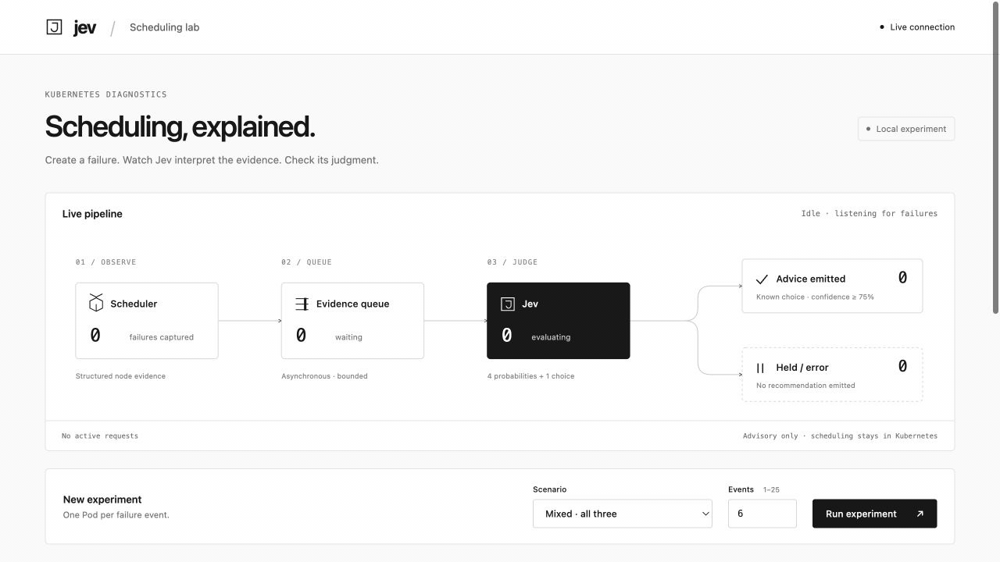

# TypeSafe Scheduler Diagnostics

Explain why an accepted Pod cannot be scheduled, and where to investigate
next. This experimental Kubernetes scheduler extension uses TypeSafe / Jev
to turn scheduler rejection evidence into a typed likely cause and a
code-owned recommendation. It does not make placement decisions or fix workloads.



A 23-second capture of the **Jev Scheduling Lab**: nine real Pods in kind,
live diagnosis, validation, and storage evidence. Demo label agreement is not
a production accuracy estimate.

## Why use it?

Help application owners answer "why is my Pod still Pending?" with less
investigation and fewer wrong-team handoffs:

- **Find the next useful check.** Distinguish capacity, workload constraints,
  storage/devices, transient state, and scheduler-extension problems.
- **Keep the evidence attached.** Inspect the rejecting plugin, its messages,
  and affected-node counts alongside the advice.
- **Inspect before trusting.** See typed probabilities, withheld advice,
  errors, latency, and agreement with labels hidden from Jev.

For example, a volume's *node affinity* failure should send you to PVC/PV
topology, not straight to editing the Pod's selector.

Admission control asks whether a configuration should be accepted; this asks
why an accepted Pod could not be placed. They are complementary. The tradeoff
is a custom secondary scheduler with opt-in workloads. For a few familiar
errors, ordinary rules are simpler and cheaper. See [the comparison and
evaluation guidance](docs/tradeoffs.md).

## Run the lab

You need Docker, kind, kubectl, make, and an environment file containing
`TYPESAFE_API_KEY=...`. The demo uses Kubernetes 1.36.4.

From this repository:

```sh
make kind-up
kubectl config use-context kind-typesafe-diagnostics
make kind-demo TYPESAFE_ENV=/path/to/typesafe-env
make ui
```

Open [localhost:8080](http://localhost:8080). Choose a scenario, generate
1–25 failure events, and inspect the results. Each event starts with a real
Pod using `spec.schedulerName: typesafe-scheduler`. Remove the demo cluster
with `make kind-down`.

This is advisory-only and experimental. Bounded failure evidence is sent to
the TypeSafe API; the key stays server-side. It does not diagnose every
Pending Pod. Review the [data boundary and limitations](docs/architecture.md#data-boundary)
before using it with real workloads.

## Documentation

- [Demo guide](docs/demo.md) — scenarios, dashboard, kubectl commands, and cleanup.
- [Tradeoffs and evaluation](docs/tradeoffs.md) — admission controllers, rules,
  deployment choices, and what the demo does not prove.
- [Architecture](docs/architecture.md) — data flow, guardrails, and production path.
- [Development](docs/development.md) — tests, builds, and source layout.
